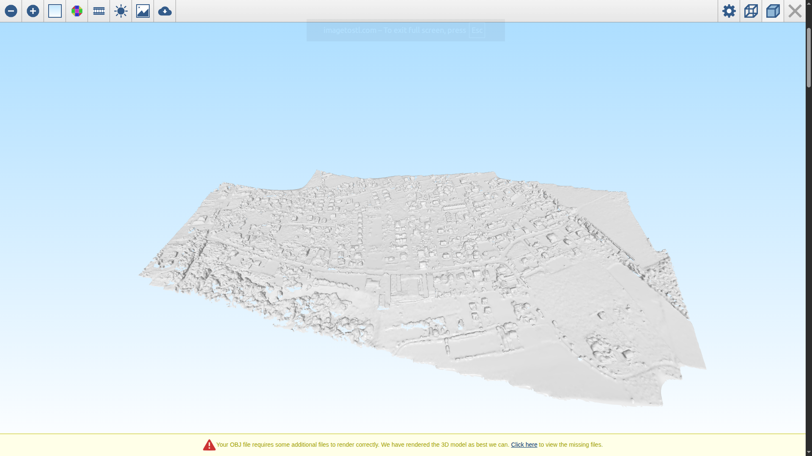
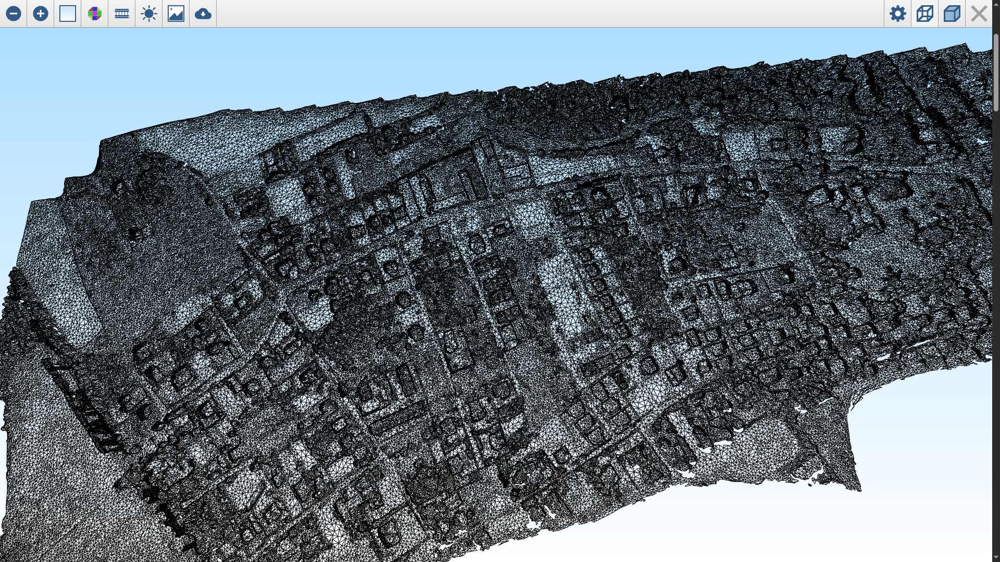

# Convertion 3d OBJ model to KMZ file

## How to use:
1. Install python version - `3.12.4`
2. Install required packages - `pip install requirements.txt`
3. Run script `conversion_3d2kmz.py`
    ```
    Input params:
       > model_obj_file_path - path to 3d OBJ model file
       > georeferencing_file_path - path to file with coordinates
       > output_kmz_path - path to kmz output file 
    ```
4. Usage example: 
    ```
    python conversion_3d2kmz.py /absolute/path/to/my/3d.obj gecoorss.txt /save/here/file.kmz
    ```

## Dir structure
File: `model_kmz_text.kmz` - converted file based on test-task description


## Test run
1. Coordinates: [lat : 48.257872372270846] [lon : 25.90294701141752]
2. File to convert: <source-archive>/texturing/textured_model_geo.obj ()
3. File result: 
4. Service to preview online: https://imagetostl.com/view-obj-online
